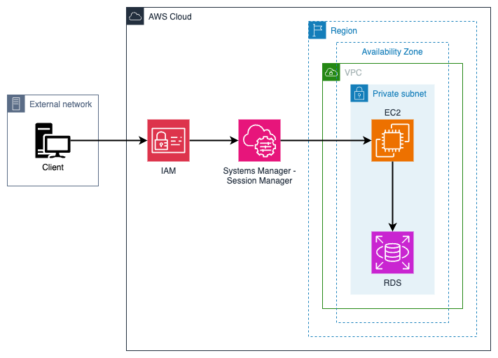

# aws-db-jump-host

> This project is part of my software architecture journey and more specifically the cloud platforms path. See my [software-architecture-journey](https://github.com/mykingdomforapawn/software-architecture-journey) repository for more details.

It is very common to deploy critical components into private subnets and restict any communication with clients outside of network. This solution implements an approach to access those resources without having to open any ports. It leverages the Systems Manager - Session Manager, AWS IAM and the Direct Connect technology.  

---

## Table of contents:

- [Get started](#get-started)
- [Solution diagram](#solution-diagram)
- [References](#references)

---

## Get started

### Configure an OIDC client in the IdP
- Create a client with a set of credentials
- Configure one of the following redirect URIs in the IdP client
    - https://[ALB domain name]/oauth2/idpresponse
    - https://[ALB alias]/oauth2/idpresponse

### Register a domain name with Route 53
- The OIDC integration needs to have an HTTPS listener on the ALB, which requires you to get a certificate for a domain that you own
- Whereas the certificate registration is automated in the Cloudformation template, the domain registration has to be done manually
- You can follow https://aws.amazon.com/de/getting-started/hands-on/get-a-domain/

### Populate the Cloudformation template
- The OIDC parameters can usually be found at https://[IdP domain name]/.well-known/openid-configuration
- The ALB HTTPS listener parameters can be found in Route 53 after you registered a domain

### Create the Cloudformation stack
- Create the stack and lie back
- You can access the ALB via the registered domain name
- Have a look at the diagram below to get a better understanding about what is going on behind the scenes

---

## Solution diagram

---

## References
- https://aws.amazon.com/blogs/database/securely-connect-to-an-amazon-rds-or-amazon-ec2-database-instance-remotely-with-your-preferred-gui/
- https://aws.amazon.com/blogs/aws/new-port-forwarding-using-aws-system-manager-sessions-manager/
